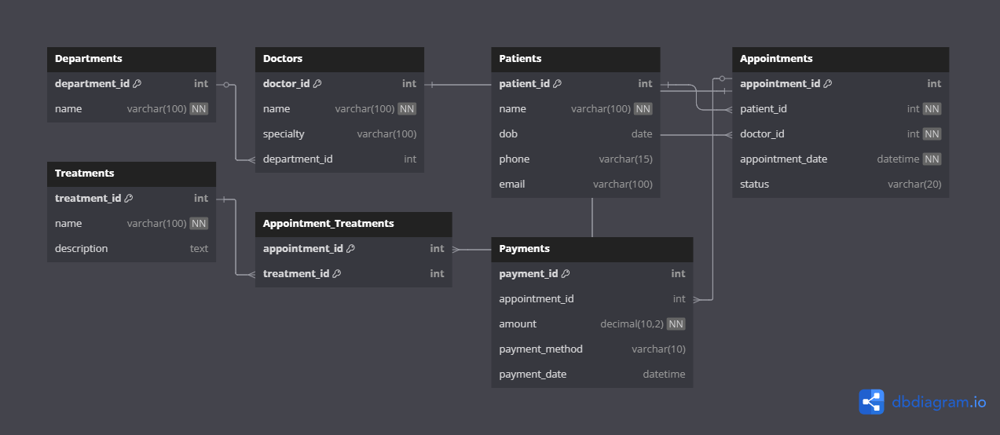

# 🏥 Clinic Booking System 

Week 8 Database Assignment


## 📌 Project Description

The **Clinic Booking System** is a MySQL-based relational database designed to streamline the management of a clinic’s departments, doctors, patients, appointments, treatments, and payments.

This database supports:
- Patient and doctor records
- Departmental organization
- Scheduled appointments with status tracking
- Treatment recording (including many-to-many relations)
- Payment tracking linked to appointments

It is ideal for small to medium clinics seeking to digitize and manage booking operations efficiently.

---

## 🛠️ How to Set Up

1. **Install MySQL** (if not already installed):
   - Download and install from [MySQL Downloads](https://dev.mysql.com/downloads/)

2. **Import the SQL File**:
   - Open your MySQL client (e.g., MySQL Workbench or command line)
   - Run the provided `clinic_booking_system.sql` script:
     ```sql
     SOURCE path/to/clinic_booking_system.sql;
     ```

3. That’s it! The database will be created and populated with sample data for testing.

---

## 🗂️ Tables Overview

| Table Name              | Description                                     |
|-------------------------|-------------------------------------------------|
| `Departments`           | Lists clinic departments                        |
| `Doctors`               | Doctor info including specialty and department |
| `Patients`              | Patient info with contact details               |
| `Appointments`          | Booking info linking patients and doctors       |
| `Treatments`            | Medical procedures/treatments available         |
| `Appointment_Treatments`| Junction table for appointment–treatment M:M    |
| `Payments`              | Records payments linked to appointments         |

---

## 🔄 Relationships

- **1:M** between:
  - Departments → Doctors
  - Patients → Appointments
  - Doctors → Appointments

- **M:M** between:
  - Appointments ↔ Treatments via `Appointment_Treatments`

- **1:1** between:
  - Appointments → Payments

---

## 🧠 Author

**Eileen Esendi**  
Email: esendiea@gmail.com  
GitHub: [github.com/esendiea](https://github.com/esendiea)

---

## 🖼️ ERD Diagram




---

## ✅ Sample Queries to Try

```sql
-- View all appointments with patient and doctor names
SELECT a.appointment_id, p.name AS patient, d.name AS doctor, a.appointment_date, a.status
FROM Appointments a
JOIN Patients p ON a.patient_id = p.patient_id
JOIN Doctors d ON a.doctor_id = d.doctor_id;

-- Check payments made
SELECT * FROM Payments;
